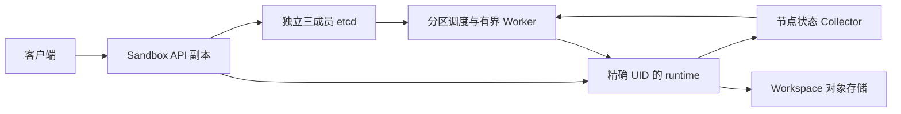

# Sandbox etcd 状态管理与大规模常驻沙盒方案

日期：2026 年 10 月 6 日。范围：状态后端、控制面调度、runtime 管理协议、部署与单环境切换。当前阶段：待实施方案，已完成三条独立审查线的两轮全面审查与最终针对性复核；实施必须完成本文定义的协议和容量验证。

采用独立 etcd 作为唯一权威状态后端，删除 Redis 及 Sentinel 相关运行依赖。同时重构随已有沙盒数量增长的全量扫描、常驻续租和 FUSE 健康轮询。只替换存储驱动无法解决大规模问题。

重点容量变量是存活沙盒数 N，而非仅申请 QPS。普通空闲沙盒应主要占用元数据和 runtime 资源；控制面持续工作应随正在执行的操作、到期任务、状态变化及必要的健康检测增长。持续挂载、自动同步和真实运行的容器仍有成本，不能把空闲等同于零成本。

## 目标与取舍

必须保持同一存储身份和规范化路径的 workspace 只有一个有效 owner，同一 workspace 重复申请返回已有可用 sandbox，已有配置与 TTL 保持不变。Kubernetes 请求可到任意 API 副本；Docker 状态也迁入 etcd，但仍只支持绑定本地 Docker daemon 的单实例生命周期。

采用三个架构层次：

| 方案 | 效果 | 决定 |
| --- | --- | --- |
| 原样用 etcd 实现 Redis 接口 | 改善权威状态一致性，保留全量扫描与每沙盒后台工作 | 不作为最终方案 |
| etcd 原生事务和租约，加事件与到期任务调度 | 同时处理一致性和大量已有沙盒的控制面开销 | 当前实施目标 |
| 多 cell，每个 cell 独立 Kubernetes 与 etcd | 分散元数据、runtime 和故障域压力 | 大规模扩展目标，先建立稳定路由边界 |

第一版一个 cell，不增加第二个业务状态数据库，不保留 Redis 兼容分支，不做在线双写。百万条元数据与百万个运行 Pod 分开评估；后者需要多 cell，不能靠扩大一个 etcd 集群解决。

选择etcd是因为workspace唯一owner、生命周期CAS、管理能力与故障恢复需要一个明确的线性一致权威。原生Txn、revision、Lease和可重建Watch适合这些协议。当前Redis路径已经使用CAS/Lua及WAIT改善安全，不能简单视作缺少锁；但Redis官方明确[WAIT不使系统成为强一致存储](https://redis.io/docs/latest/commands/wait/)，故障切换仍可能丢失已确认复制的写，对永久owner/fence尤其不利。继续保留Redis需要自行维护更多故障协议，单环境允许清空旧实例后切换，因此选择彻底移除。

etcd也有代价：写入经Raft复制，leader/磁盘延迟影响所有写；单backend容量有限，Lease、Watch及维护有成本。逻辑partition不能增加同集群写吞吐。其优势是权威协议更明确，不是把Redis的高频心跳和全量扫描搬过去后自然获得更大容量；本方案将小而关键的控制状态留在etcd，执行数据和健康常态流量由runtime及collector承担。

## 当前实现的规模瓶颈

以下引用基于仓库 HEAD b99b823；公式是代码路径估算，不是压力测试结果。

| 当前行为 | 代码位置 | 随规模增长的影响 |
| --- | --- | --- |
| 所有 API 副本遍历 active records | internal/sandbox/lifecycle_coordinator.go 的 runActiveLifecycleCoordinator 与 reconcileActiveLifecycleControllers | 每次扫完再等待约 5 至 6 秒；分页 128 条没有限制整轮扫描总量 |
| Redis Scan 后逐 ID GET | internal/storage/state/redis/active_sandbox.go 的 Scan | 全量读和 JSON 解码约为 R×N 每轮；大 N 时扫描时间本身也增加 |
| workspace controller 每 5 秒 RenewController | internal/sandbox/lifecycle_coordinator.go 的 activeController | 已管理的 workspace 持续修改状态；其他 API 扫描还会尝试争抢 controller |
| workspace lease 单独续期 | internal/sandbox/workspace_lease.go 的 StartRenewal | 默认 120 秒 TTL、30 秒续期，另一个每 workspace goroutine |
| 每 FUSE sandbox 默认 5 秒健康检查 | internal/sandbox/manager.go 的 startFUSEWatcher 与 checkFUSELifecycle | 每轮 BeginOperation、EndOperation，多个 Pod GET 和 Pod exec；用户不执行也会发生 |
| pool pristine 审计遍历 session、ephemeral、owner | internal/sandbox/manager.go 的 guardFUSEPoolRecord | 池记录数 P 与全部记录 N 形成接近 P×N 的检查放大 |
| 申请争用固定 50 毫秒重试 | internal/sandbox/workspace_acquire.go | 等待者每秒约 20 次检查，热点 workspace 产生无效状态请求 |
| ordinary pool 全池读取与补充锁 | internal/sandbox/ordinary_pool_shared.go 的 acquire、refill、withPoolLock | acquire 已使用单记录 CAS，但先读全池再争抢；refill 和维护持池级锁，准备过程串行 |

全量扫描的平均记录读取率近似为：

```text
scan_records_per_second = R × N / (5秒 + jitter + 完成一轮的时间)
```

例如 R=3、N=100,000，忽略扫描耗时的上界近似为 60,000 条记录每秒。若每条 JSON 8 KiB，仅传输 payload 已接近 469 MiB/s。真实值会因扫描变慢下降，但相应地恢复和发现延迟会增长。

当前 FUSE 健康路径中，BeginOperation 内一次 GetSandbox，checkFUSELifecycle 一次 GetSandbox，WorkspaceHealth 的 getExactPod 再一次 GET，随后 readMounterStatus 通过 Pod exec 执行 health ready。按默认 5 秒周期计算：

```text
Pod GET/s          >= 3 × N_fuse / 5
Pod exec/s         >= N_fuse / 5
operation 写入/s  >= 2 × N_fuse / 5
```

10 万个全 FUSE 沙盒即使用户操作数为零，也约有 6 万 Pod GET/s、2 万 Pod exec/s、4 万 Begin/End 状态写/s，尚未计入 controller 和 workspace 续租。必须消除这条长期轮询路径。

## 安全不变量

1. workspace owner 和 sandbox 权威记录永久保存；业务到期通过 expires_at 和清理任务表达，不通过 etcd Lease 自动删除权威记录。
2. owner 绑定 workspace hash、sandbox ID、runtime ID 与不可复用 UID、workspace generation 和 mount attempt。释放 owner 必须同时证明旧写入者不能继续发送、全部相关已发送远端写已 settled/被明确拒绝，或外部 write fence 使其不能影响新 generation。进程退出或节点隔离本身不包含远端结算证明。
3. 管理者租约消失仅意味着管理权失效，不能证明容器、FUSE 进程、exec 或远端对象存储写入已经停止。
4. phase 的关闭准入与 operation 入场使用同一权威 control key 的 revision 条件；销毁与新入场必须有明确的事务先后关系。
5. 所有副作用都需要精确 runtime 身份。etcd 条件更新保护元数据；runtime 管理命令另有执行层 fencing，二者不能互相替代。
6. 事务超时属于结果未知。不存在记录的单次读取不能证明此前仍在传输中的事务不会晚到提交。
7. owner、runtime 或外部写入结果不确定时保留 cleanup_pending 和永久 intent，不通过清空状态重新申请。
8. 不使用 Watch、本地缓存、API 墙钟或 Pod 名称作为唯一执行授权。
9. 同一实体、索引、任务和回执的事务都落在同一 cell 的一个 etcd 集群中。
10. 所有授权和 claim 事务比较当前 restore_epoch；灾难恢复纪元为不可复用 ID，不依赖旧快照内计数递增来保证唯一。

etcd 的 KV 一致性是选择它的基础，详见 [API guarantees](https://etcd.io/docs/v3.6/learning/api_guarantees/)。上述业务安全不变量仍需由 sandbox 实现。

## 组件与职责

API 负责请求认证、参数校验、幂等、短事务准入和直接 runtime 数据操作。后台 Worker 可以先复用同一二进制的 worker role，但通过独立 Deployment 设置并发和资源；大规模时不让 HTTP 副本数决定后台副本数。

etcd Client 管理连接、事务、Lease、分页 Range 和 Watch 恢复。各领域 Repository 管理自己的状态机；跨领域的创建、绑定和清理由组合事务方法处理，不在 Manager 中拼接多个独立 Set。

Partition Scheduler 负责到期任务、dirty queue 和有限 worker。Runtime 管理 helper 负责数据准入屏障、可靠健康检测、管理命令的 epoch fencing、幂等回执以及全部用户后代进程的排空。大规模 Kubernetes 使用节点级状态 collector 汇聚 runtime 报告；helper 运行在可信边界内，用户 exec 不能写入它的 epoch、回执或控制凭证。



客户端请求无需 API 间转发；collector 的内部状态汇聚不改变这一点。执行和文件数据不经过 etcd。

## Key 与记录模型

命名空间统一为 `/sandbox/v1/<scope>/<cell>/`。scope 是不可随 Helm release 改名的 authority ID，路径由服务端计算，不接受客户端传入完整 key。workspace hash 包含 provider、稳定 storage identity、bucket、规范化 prefix，不只对路径做 hash。

首次安装创建 meta identity，绑定 authority ID、etcd cluster ID、schema、prefix、cell、storage authority 和 runtime cluster/daemon 身份。启动按部署契约精确校验，空 keyspace 不能自动当成可用的新后端。独立 operator 初始化与迁移审计负责建新 identity；应用只校验，不能自行 reset。证书和 endpoint 地址轮换不改变 cluster identity。

同一个外部 workspace 命名空间只能由一个已登记 authority/placement 管理。新增 release 或 scope 必须使用隔离的对象存储 prefix；共用 prefix 需加入同一 authority。Chart state fingerprint 纳入 schema、helper 协议、authority、prefix、cell 和 cluster incarnation；更换后端身份需显式旧版本 drain，普通升级或 rollback 不得绕过。etcd 自身无法阻止一个未经治理的第二集群同时访问同一对象 prefix，因此部署注册和存储权限隔离属于必要约束。

每个 cell 固定 256 个逻辑 partition，workspace hash 决定其 partition；没有 workspace 的 sandbox 用 ID hash。partition 只划分调度和 key 空间，在同一个 etcd 集群内不增加存储吞吐。

| 后缀示例 | 内容 | 生命周期 |
| --- | --- | --- |
| p/07/controls/id | phase、generation、data gate epoch、runtime ref、snapshot revision、expires_at、transition 与 cleanup 摘要 | 清理确认后条件删除 |
| p/07/snapshots/id/version | 较少变化的配置和恢复快照 | 有界保留，旧版本安全 GC |
| p/07/workspaces/hash/owner | 唯一 owner、runtime ref、generation、mount attempt | 发送端隔离与远端写结算或外部 fence 证据均成立后条件删除 |
| p/07/workspaces/hash/fence | workspace generation 与 restore epoch | owner 删除后仍保留或安全归档 |
| p/07/sandboxes/id/operations/token | 正在执行的操作能力 | 专用 operation Lease |
| p/07/sandboxes/id/mutation | 单个生命周期修改能力 | 同一 operation Lease |
| p/07/attempts/attemptID/guard | 固定 attempt ID、Lease ID 与 restore epoch | 专用 operation Lease，永不重建同 ID |
| p/07/attempts/attemptID/receipt | 操作入场 committed 或 aborted 结果 | 同一专用 Lease，guard 失效后可删除 |
| requests/principal/hash | 申请幂等 ID、配置摘要、pending/completed状态、绑定 intent 与结果 | cell 内按 principal/key 唯一；危险未决结果保留 |
| p/07/intents/operationID | 副作用身份、阶段、runtime 或 worker UID、已发送请求和回执 | 成功终态并完成防重放后 GC |
| p/07/stages/requestID/logicalStageID/attemptID/receipt | 一笔危险元数据事务尝试的 committed/aborted 回执 | 不与整个申请结果或 target 执行回执混用 |
| p/07/due/kind/time/id | 到期、sync、健康复核或 cleanup 时间索引 | 与 control/task 同事务更新 |
| p/07/dirty/id | 需要协调的实体与 version | 去重后条件消费 |
| p/07/tasks/id | 待处理任务、状态、尝试和 checkpoint | 终态安全 GC |
| p/07/tasks/id/claim | 当前执行能力、epoch、worker session | 有界任务 Lease |
| indexes/runtime/uid | runtime 到 sandbox 或 pool 的精确反向引用 | 与绑定和清理同事务更新 |
| pools/fingerprint/records/id | preparing、prepared、reserved、binding、consumed、cleanup | 终止证明后条件删除 |
| pools/fingerprint/ready/bucket/id | 可分配资源索引 | 与 pool 状态同事务更新 |
| pools/fingerprint/slots/slotID | 有限预热或创建配额槽位 | 持久占用，安全清理后释放 |
| p/07/uploads/id/control | multipart 状态、sandbox ref、摘要和期限 | 显式 abort 或完成后清理 |
| p/07/uploads/id/chunks/number | 分片状态与摘要 | 数据成功归并后清理 |
| meta/restore_epoch | 灾难恢复或环境重置 epoch | 永久 |

control 和 owner 目标均小于 1 KiB；snapshot 平均 4 至 8 KiB，默认硬上限 64 KiB；任务回执超过 64 KiB 的明细外置到受控对象存储，并保存摘要引用。multipart 分片独立存储，避免每上传一片重写大数组。任何记录上限都需错误码与配置验证。

etcd 默认请求上限 1.5 MiB、backend quota 2 GiB，普通环境建议最大 quota 8 GiB，见 [System limits](https://etcd.io/docs/v3.6/dev-guide/limit/)。应用上限主动留出事务和复制开销。

snapshot 与 control 采用不同 key family，避免 prefix Watch 连带推送大快照。control 指向 immutable snapshot version；入场事务验证对应 control revision 后获取其快照引用。API 按 `(sandboxID, version, digest)` 使用 weighted LRU，默认 64 MiB，cache miss 共享只读 singleflight；worker 领取实际 task 后才读取快照，默认 32 MiB LRU。control 与准入仍线性确认，快照缓存不授予执行权限。

旧快照 GC 先确认已非 current version，原 control revision 已被新 revision 替代，所以新的 operation 不能引用它；再确认没有持有该 version 的 operation 和未决 runtime intent，才删除。未知或租约已失效但 runtime 效果未排空的 intent 仍阻止 GC。高 λ、低 cache hit 场景单独统计 snapshot Range/s、bytes/s 与解码 CPU，例如 10,000 次 operation/s、8 KiB 全 miss 是约 78 MiB/s payload，不因 control 较小就消失。

## 并发申请与复用

健康已有 sandbox 的复用路径不持有覆盖全部检查和返回过程的 workspace 分布式锁。读取 owner 与 control，检查一致关系、业务到期与 runtime 可用性，最后用同一只读事务确认 owner/control revision 未改变。可用性是检查时点的观察；返回后仍可能自然失效。真正 exec 或文件操作必须重新进入 operation gate。

首次申请路径如下：

1. 计算 workspace identity、partition 与请求摘要。客户端可提供 Idempotency-Key；同 principal 和 key 的不同摘要返回 409，同摘要查询原结果。已有 workspace 可按 owner 唯一性复用。
2. 一个 Txn 同时比较当前 restore_epoch、申请 attempt guard、owner 不存在、fence 的旧 ModRevision、request 不存在和 AcquireStage receipt 不存在，并原子写 request=pending、provisional owner、递增 generation、永久 intent、publishing control 与 AcquireStage=committed 回执。etcd 不执行 JSON 或整数计算；客户端读取后计算，以 ModRevision CAS 重试。generation 使用正 int64，溢出拒绝创建且不修改状态。
3. 争用失败者监听 owner/control 的 partition watch hub，再读权威状态。正常发布后返回同一 sandbox。只在不存在 owner 的事务成功后允许开始新 runtime 创建。
4. 创建者持有 intent claim，先预留 pool 或冷建 quota slot，再执行 runtime 工作。实际 runtime 带 sandbox ID、intent ID、restore epoch、generation；准备 runtime 的确定性名称与身份可用于未知创建结果的查询，不能凭名称直接接管。
5. 发布 exact runtime UID、owner 绑定、active control、runtime 反向索引、request=pending→completed 与 PublishStage=committed receipt 使用组合事务，比较合法 publishing control、exact task claim 和原 request digest。mount attempt 必须消费一次且被持久化；超时不能重新挂载。
6. 未知事务结果通过后文的 receipt 协议解决。创建者 HTTP 请求取消后，已持久化 intent 由 worker 接续明确的状态步骤；不能无记录地重复非幂等副作用。

同一 workspace 的本机请求使用 bounded singleflight 与等待者广播，跨副本等待复用 partition Watch，不为每个等待者建立一个 etcd Watch。等待者取消不取消已经获得 durable intent 的创建任务。与现有语义一致，已有 sandbox 不因新参数更新配置或续 TTL。

幂等 request key 在 cell 根 requests family，由 principal+Idempotency-Key 决定，与 workspace partition 无关；同 cell 的组合事务可跨逻辑partition。这样同key改workspace也会409，不会在两个partition各创建一次。跨cell的请求路由与幂等范围须按阶段六单独定稿；不能将principal/key与workspace分别路由到不同cell后，在两个独立etcd间拼接创建事务。

同步等待总上限默认 30 秒，入口队列和内部等待合计计算。正常争用在服务端等待；限流返回 429，状态不可用或等待期限耗尽返回稳定的 503 与 Retry-After；危险归属歧义保留专用 recovery required 状态。无 workspace 创建的 503 或未知结果响应返回 request/intent ID，并提供按 ID 的只读状态查询接口。

Go SDK 保留现有 CreateSandbox 调用签名，新增可选创建 options 支持 Idempotency-Key；错误类型保留 Retry-After、request ID 和明确的 retryable/unknown/pending 分类。网络超时后的无 workspace 请求必须使用原幂等键查结果，不盲目换 key 重建。SDK 默认 HTTP 总期限建议 40 秒，长执行/stream 继续使用独立配置；旧 SDK 成功响应兼容测试保留。

## Operation gate 和 Lease

第一版每个正在执行的 operation 使用独立原生 Lease，TTL 默认 30 秒，约 10 秒 KeepAlive；LeaseKeepAlive 流可以多路承载多个 Lease，不为每个 operation 建 TCP 连接。请求进程使用共享 timer 调度，不保留每沙盒 ticker。

选择独立 Lease 是为了保持请求取消、结束、失活与其他正常操作相互隔离。它的数量随正在执行的操作 C 增长，不随普通空闲沙盒 N 增长。共享 API session Lease 不是第一版优化项：健康 API 持续续租可能使已经失活的单个 operation 永久阻塞销毁，而且 session 过期有集中删除的影响。

入场流程：Grant 专用 Lease，建立 immutable attempt guard；线性读取小 control，确认 active phase、generation、data gate epoch 和 expires_at；Txn 比较当前 restore_epoch、control.ModRevision、精确 attempt guard/Lease、receipt 不存在、mutation 或 exclusive 能力条件，原子写入 operation 能力和 committed receipt，返回对应 snapshot 引用。失败 CAS 有限次数重读后退避，不修改 control 来累计操作计数，避免把每个沙盒变成热计数器。guard 创建结果未知时，不发送入场事务，查询 exact guard 或让 Lease 到期；不重建该 guard ID。

业务期限采用受控 UTC 时钟，初始最大误差预算 Δ=1 秒，持续监测 NTP/时钟偏差。申请复用、operation、mount/Resume 和任务开始，在事务前与实际执行前均检查 `now + Δ >= expires_at`，达到则拒绝；偏差不可确认时暂停期限敏感准入。期限包含在被 CAS 的 control 中，TTL 更新使旧检查 revision 失效。etcd 没有 Redis TIME 或事务 now，不能承诺绝对真实时间的原子到期。已有操作允许跨业务到期继续排空，但受自身 timeout 和 Lease 约束；due worker 停机不应使过期 sandbox 继续接受新操作。

生命周期 mutation 额外要求 mutation key 不存在；独占操作先 CAS phase 为 workspace_exclusive，阻止后续入场，并在 runtime 关闭对应 data gate，再排空已有操作。续 Lease 不改变业务 control revision。结束操作先确认实际 runtime 操作终态，再条件删除精确 token 并 Revoke 独立 Lease；结束重复调用幂等。租约消失而外部结果未知时保存永久 effect intent，不把其当作已排空。

正常短操作的调用预算至少包括 Grant、guard Txn、admit Txn、end Txn、Revoke 五类 RPC，另加 control/snapshot 读取；不能只计算两次业务 key 写。首版不预借 Lease 共享这些 guard。入场失败和取消回收未使用 Lease；Revoke 超时不创建新能力，等待 guard 消失并记录清理 lag。显式 Revoke 与批量自然到期分别压测。

客户端以 KeepAlive 请求发送前的本地单调时间加服务端 TTL 计算保守截止时间，不能用响应到达时间直接加 TTL。网络故障、GC 暂停或 deadline 越界后取消请求、停止后续命令；不能重新 Grant 一个 Lease 后把旧操作复活。etcd 未及时删除 token 只会延后接管，不能据本地墙钟删除他人的 token。

Lease 到期只说明准入能力失效。所有 API 发起的 exec、文件与 stream 指令均经过可信 helper，携带 exact UID、generation、restore epoch、data gate epoch、operation ID 和有界有效期能力。helper 持久维护 data gate 的 open/closed 状态和已接受操作；关闭某 epoch 后拒绝该 epoch 的所有迟到命令，已接受操作被排空或精确隔离。

必须覆盖这一交错：旧 API 已取得 token、命令仍在途中，Lease 到期后 token 消失，destroy 查到 zero ops，旧命令随后到达。同一 RuntimeUID 不能拒绝它；runtime 的 closed gate 必须拒绝。exclusive 重新开放时增加 data gate epoch，分阶段记录 reopen intent，helper 和 etcd control 都确认新 epoch 后才能 active；未知状态保持关闭。任何旧 operation 不得跨 epoch 复活。

## 销毁与 cleanup

销毁首先 CAS control 从 active 到 destroying，写 durable cleanup task 和 intent。BeginOperation 与这一步都比较同一个 control revision：先入场者留下 token，后入场者 CAS 失败。

关闭 etcd 准入后，先通过合法 task epoch 在 runtime 持久关闭相同 data gate，拿到 closed 回执，防止网络中的迟到命令入场；然后用线性 Range 查询 operations prefix 并排空 helper 中已接受的操作。分批读取不要求把所有 token 装进一个事务，也不依赖跨范围操作计数比较。只有这两层排空或精确隔离均完成，才能 final sync/flush；取消 context 不是运行进程已经退出的证据。

cleanup 分阶段持久化：close admission、quiesce、final sync 或 flush、exact runtime termination、policy/mount 清理、owner 释放、索引删除、control 删除和 committed receipt。任何阶段失败进入 cleanup_pending。最终 Txn 同时验证 restore_epoch、control、owner、runtime UID、generation、live task claim、发送端终止证据、远端写 settled/fenced evidence 版本和相关 effect intent 终态。对没有对象存储写的普通 sandbox，远端项可由明确的无此类 effect 证据满足；不能按记录缺失猜测。

业务到期使用 due index 触发同一销毁流程。权威记录永不先于安全清理消失；Docker 的 persistent session 也改为 expires_at 而不是物理 TTL。

合法 phase 转移如下，均与 task/due/dirty 同事务维护：

| 来源 | 目标 | 必要条件 |
| --- | --- | --- |
| publishing | active | exact runtime与mount完成、helper gate确认、当前claim有效、期限未到、request摘要相同 |
| publishing | destroying或cleanup_pending | durable intent归因清楚；禁止任何旧publish晚到回active |
| active | workspace_exclusive或destroying | exact control CAS，同时永久关闭etcd准入并创建任务 |
| workspace_exclusive | active | 当前claim有效、无未知effect、新runtime data gate epoch已确认、control CAS匹配 |
| workspace_exclusive | destroying或cleanup_pending | 失租或效果未知时保持关闭，通过合法恢复任务处理 |
| destroying | cleanup_pending或安全终态删除 | 单向cleanup，不能重新发布active |
| cleanup_pending | destroying或安全终态删除 | 明确checkpoint和恢复证据，不盲目重开 |

task能力包含不可复用claim ID、claim CreateRevision、Lease ID、restore_epoch和live guard。claim与guard都附原task Lease；所有checkpoint、副作用授权和完成事务比较guard/claim精确值、LeaseValue、CreateRevision及owner/control revision。失租后不能重建同guard或缓存capability继续提交。恢复exclusive先查询target receipt/effect intent；无dispatch或已明确terminal且安全的新gate才允许重新开放。到期任务还比较expires_at版本，不能销毁已续期的新control。

## 事务未知结果和幂等回执

多阶段 request 的 pending/completed 结果、每笔元数据事务尝试的 stage receipt、外部 target 的执行 receipt 三者分开。logicalStageID与attemptID在尝试前确定，同一事务尝试的网络重试和结果仲裁始终使用相同attemptID。原事务比较 restore_epoch、live attempt/claim guard、该attempt receipt不存在和精确前置revision，再原子提交状态变化与committed receipt；AcquireStage也在首次申请事务内提交，不能等整个runtime创建完成才写。

超时后读到确切attempt committed receipt可证明那一事务尝试提交。读到absent仍不是失败证明；resolver发Txn：比较当前restore_epoch，若该attempt receipt不存在则写aborted，否则返回现有receipt。迟到原事务与abort争抢同一个compare，最多一个成功。初始Acquire已commit但总request仍pending时，不得abort整个request；worker继续从已提交stage恢复。abort只阻止未提交元数据事务，不撤回外部副作用；副作用必须在授权事务和intent明确后开始。

logical stage与txn attempt分开：同一阶段被明确aborted后，合法重试生成新attemptID、guard和receipt，并重读前置revision；旧aborted marker绝不改写成committed。stage intent记录当前attempt与终态，未知外部效果禁止创建新的执行attempt。

短期 operation 入场的专用 attempt guard 是第一版必需机制，原事务永远比较固定 guard value、Lease ID 与 restore epoch。resolver 在同 guard 有效时对 receipt 作 commit/abort 竞争；Lease 撤销或过期后 guard 和 receipt 均消失，迟到原事务因 guard 缺失永远失败，不能重建同 ID。API 创建的永久申请 intent 一旦成立，由新的 task claim 续接，不能续接旧 attempt 的执行能力。

回执不能只依赖固定 TTL GC。永久 intent/owner/control 的不可复用 revision 或 restore epoch 必须先让旧尝试不可能提交，再删除防重放 marker。幂等窗口到期后的同 Idempotency-Key 请求可被视为新申请，但不允许重复的请求与尚未决的旧 intent 并行。

GC状态机为pending→terminal→fenced→collectable。terminal需要元数据和外部效果终态；fenced必须证明原attempt guard永久失效、旧task claim不可复用、runtime回执完成且旧revision不能提交。成功幂等结果默认保留1小时，响应提供幂等窗口截止时间；可按明确容量预算配置24小时，不能无条件承诺。过窗只有fenced后才回收receipt/intent；未知结果不因过窗当新申请。

GC默认全cell 500 records/s起步，按实测调整，必须满足可回收记录服务率大于 `λ_new×每申请终态记录数 + λ_task×每任务终态记录数` 并有余量。若GC lag持续增长或预计幂等工作集超quota预算，收紧新申请速率，不只调短保留窗。有限每批事务与字节预算保护Lease/cleanup优先级，给GC独立worker预算。

幂等工作集容量为 `λ_new×retention×B_request_workset`，B包含request、尚保留stage和terminal intent结果。示例λ_new=100/s、每request总1KiB、1小时约351.6MiB payload，24小时约8.24GiB；还需backend放大。只是request本体256bytes、24小时也约2.06GiB。因此1万或10万存活N并不能单独确定容量，历史申请量与保留窗同样是准入预算的一部分。

workspace fence 按历史唯一 workspace 数 U 计量，不按当前 N 计量，首版不自动删除 fence。未决 intent/外部效果永不按年龄删除，数量和字节达到预算时告警并限制新建，提供修复和人工证据流程；不能以无限增长换取表面可用。若以后归档 fence，必须用不回退的 authority incarnation/外部目录保证同 workspace 不出现 ABA，另做协议验证。

## Workspace 管理权与外部执行 fencing

新版取消每 workspace 的常驻 etcd TTL 租约。独占写入安全来自永久 owner、唯一 mount attempt、exact runtime UID 和安全释放条件。健康已有 FUSE mount 在管理 worker 短暂重启或失租时可继续运行，owner 继续阻止其他 runtime 接管。

这是对当前 lease loss 导致 teardown 行为的主动调整。API 无法确认 etcd 时仍拒绝新管理操作；runtime 存量执行和挂载在 owner 未释放时可继续，不把控制面短暂故障放大为全部 sandbox 销毁。

后台task管理能力用 `(restore_epoch, claim_create_revision, operation_id)` 表示，固定采用etcd claim的CreateRevision。同一claim续租/更新不能改变epoch；新claim使用不复用ID。helper持久记录已接受epoch，拒绝旧epoch后续命令，串行协调已开始命令；新高epoch不能覆盖未知flush/sync而立即并行。

管理操作 Quiesce、Flush、Resume、Unmount、网络变更与清理需要 operation ID 和 durable runtime 回执。QuiesceToken 绑定 generation、runtime UID、task epoch，只能由相应合法步骤消费。首次部署前的准备期把 generation、epoch、helper 凭证和 runtime 身份绑定好；用户不能通过 exec 伪造管理能力。

第一版新增受信runtime launcher binary与版本化协议包。实际用户执行由sandbox容器内受保护PID1 launcher负责，保留原语言镜像、workspace mount、network namespace和资源cgroup；sidecar仅认证、协调与观察，通过受保护IPC调用launcher，不能在sidecar自身执行用户程序。Docker使用同样的sandbox PID1 launcher，host agent通过受信通道协调；不新增nsenter/CRI主机特权。FUSE mounter保留可信进程并扩展epoch/receipt。

launcher父进程使用专用管理身份，凭证、closed gate和回执目录只允许该身份读写；用户命令在exec前降到原sandbox UID/GID，清理补充groups与全部capabilities，禁止no_new_privs反转，保持原seccomp/LSM与只读rootfs。若实现父进程用UID0和SETUID/SETGID/KILL，必须明确只在受信launcher使用这些最小capability，子进程全部移除；更新securityContext、AppArmor/seccomp、IPC、root-owned Secret/状态卷与镜像契约并审查，不将任意用户shell作为root执行。原sandbox资源limit仍覆盖launcher固定开销，记录最小可配置资源与实测overhead，不静默扩大用户配额。

第一版拒绝用户UID0或与launcher管理身份相同的配置，不能靠移除capability保护同UID凭证；需要这类用户身份时另做可信隔离设计。子进程exec前关闭管理文件/目录、密钥和IPC的继承FD，设CLOEXEC并测试`/proc`/ptrace/FD读取，不能只依赖文件权限。该身份限制必须在配置与镜像校验、API错误和部署手册中公开。

PID1/subreaper登记所有后代，排空不能只杀原PGID：用户可能setsid/doublefork。在独立sandbox PID namespace中关闭全部数据入场、冻结或终止全部用户后代，并确认没有逃逸writer；禁止用户创建新namespace或修改cgroup。受信launcher自身与独立mounter不作为用户进程排空。namespace/cgroup证明缺失、launcher重启状态丢失或不明后台进程时保持gate关闭。runtime ref还携带container incarnation/boot ID，PodUID相同但容器重启不能沿用旧能力。恶意fork/伪造IPC/读父进程凭证/资源归属是阶段三必测项。

pool contract与chart fingerprint纳入launcher/mounter协议、IPC、安全配置、容器incarnation与恢复身份。当前镜像仅sleep infinity，需要明确替换CMD/PID1和增加只读launcher程序；不能假设已有sidecar天然具备上述执行能力。

API的exec/file/stream通过Runtime adapter调用launcher协议；可保留Kubernetes exec作transport，但仅进入受信入口，禁止旁路直接执行任意命令并绕gate。文件操作也以sandbox身份和ScopedFS/目录FD约束执行，不能借父进程权限读管理secret或其他路径。网络修改与Kubernetes删除仍通过apiserver，需exact UID/resourceVersion前置条件、单向生命周期与intent；helper epoch不能阻止已发apiserver请求，未知时不重开。

API 与 agent/mounter 的 mTLS 身份及 capability 由当前 authority/restore epoch 签发，凭证独立于普通 API Key，用户进程无签发权限。新恢复 ID 由受信恢复流程安装到 target 并隔离旧 ID，不能只比较 UUID 大小。多个 target 部分安装成功时保持 pending。collector 仅有观察权限，不能签发执行能力。

launcher/mounter本地回执有独立容量与GC契约：持久保存operation ID、request digest、最大已接受capability截止时间、执行终态或unknown以及epoch。重复同ID不同摘要拒绝；terminal后禁止延长capability。只有终态且所有旧能力已过期或gate/restore epoch永久fenced，才可删除；unknown保持，身份状态丢失默认关闭。默认本地journal上限256MiB、70%告警、85%拒绝新危险操作；原有管理cleanup查询保留。完整stdout/文件内容不放journal。GC与容量指标按每runtime操作速率、保留时间及helper固定内存/磁盘开销预算，不能把临时256MiB上限当每Pod预分配磁盘。

对象存储通常不能理解 etcd fencing token。sync 任务需迁入独立可信 worker 或 runtime 管理任务，记录 worker UID、已发送远端请求与结果。旧 worker 终止并不能通用证明已经发出的 PUT、DELETE、CompleteMultipart 不会晚到。未知远端写未取得已完成或明确拒绝的证据前，保留 owner 与 pending intent，不启动同 prefix 的新写入。

FUSE flush 回执须区分缓存已排空、远端请求已结算、进程退出和基础设施 fence；单独进程退出可以阻止继续发送请求，但不是此前远端请求已结算的证明。已有 TerminationEvidence 字段不能无条件扩大含义。

如以后要求上述未知远端写也自动无阻塞恢复，需要引入可 fencing 的写入网关、provider 条件写或分代 staging 与 manifest 发布协议。第一版保留当前对象布局，承诺正常管理者故障可恢复，对无法证明安全的外部写入明确保持 pending。

## 分区调度与 Watch

256 个逻辑 partition 的管理权由少量 worker session Lease 承载；每个 partition 一个 claim key，不为每个 sandbox 创建常驻 controller。worker 不维护所有 control 和远期 due 的镜像，只对近期 due、dirty 与实际任务使用有界队列和 LRU。初始每 worker 摘要/任务缓存上限 64 MiB、queue 上限 10,000 keys；超限停止从缓存调度并按索引游标重新同步，不丢掉永久 dirty/task 证据。

初始化对必要索引做分页 Range，第一页取得 revision R，后续页固定 R；完成后从 R+1 建 Watch。遇到 compacted revision 时丢弃该分区缓存并重新同步，重建期间停止从该缓存发起副作用。以共享 Watch stream 管理分区订阅，不建立 N 个 Watch；事件在内存有界队列中按实体合并。

权威 control、任务与 due index 同事务修改。Watch 只负责唤醒与候选发现，实际 claim 必须 Txn 重验。due worker 每轮只读取 overdue 及未来 60 秒窗口，单页最多 256 条且响应 payload 最多 256 KiB，heap 不装入全部远期 due；过大 overdue 由持久游标限速消费。due 时间是业务时间，不能代替 Lease 失效判定；时钟异常时暂停提前销毁并告警。

API Watch hub 只订阅有等待者的 partition 的 control/owner 族，并对待观察 key 有界去重；无等待者时取消订阅。worker 不订阅 snapshots 族，due 族的 Range/Watch 限定近期时间窗，移动窗口先固定 revision list 再从 R+1 Watch 衔接。缓存超限、Watch fragment 未完成、gap 或 compaction 不能产生授权；慢队列可丢弃内存候选后从持久索引重建。

长周期后台审计仍保留：每 partition 分页扫描摘要，默认 30 分钟一次并加抖动，使用全 cell 共享速率预算，不重复由每 API 扫描。若审计速度低于 N/周期，暴露 lag 而非把一轮循环无限延长后仍报告健康。恢复所有权时只重建到期索引与 dirty/task，不立刻对全部 runtime 发 GET 或恢复一个 goroutine。

启动与 relist 初始全 cell 预算：同时重建不超过 4 个 partition、Range payload 20 MiB/s、claim 尝试 100/s、实际任务开始 32 并发；collector 完整重传每节点单次 chunk 最多 256 KiB、最多 1 次/s并带随机退避。通过 worker 持久预算/固定租借槽保证这些不是每副本各自的 cell 总预算。readiness 暴露已同步 partition、健康覆盖与 lag；请求涉及未同步范围时用权威读取，仍无法验证则返回 503。

默认预算部署采用本etcd的固定budget-slot：每种预算有限ID，worker用原session guard+Lease领取份额，份额总和不超过配置；Range带宽和claim速率用本地token bucket执行所持份额。task/preparation硬并发slot持久到实际工作终结，不随预算Lease自动归还。HPA/rolling新增worker只借现有空份额，失租停止新工作，旧inflight计入最大chunk/请求时限的尾部；重连不能复制份额。吞吐可因固定份额失衡保守下降，运营按未占用份额调整，无第二数据库。

恢复时间至少受初始必要字节/read budget、过期 Lease 删除、任务 backlog/service rate 中最慢的一项限制，串行依赖再加等待时间。partition claim 可快速接管不代表该分区全部 sandbox 立即可用；优先恢复用户正在请求、已到期和cleanup项，测量全量恢复尾部。

## FUSE 健康与自动同步

移除每沙盒每 5 秒的 Kubernetes GET 和 exec 循环。可信 helper 在 runtime 本地检测 mount，节点 collector 聚合带 runtime UID、workspace generation、boot ID 和递增序列的报告；worker 仅将健康状态变化、未知或失效处理写入 etcd。

默认本地检测周期 5 秒，节点级报告周期 5 秒。每周期报告逐 sandbox 的轻量 freshness tuple；完整属性只在变化时发送，不能只发送状态变化就刷新全部健康。tuple 包含精确身份或已验证字典 ID、boot ID、检测 sequence、observed_at 与状态。batch/chunk 带序号、数量、ACK和gap信息；只有实际收到且验证的条目才能更新 freshness，丢失chunk不刷新整节点。有效窗口初始 15 秒，缺失、过期、节点重启或无法归属一律 unknown。

聚合后的网络仍是 O(F/报告周期) 条目。预算示例：10 万条、5 秒周期、每 tuple 64 bytes 为约 1.28 MB/s payload，256 bytes 为约 5.12 MB/s；百万条再乘十，TLS、协议和重传另计。RPC 次数约为节点数/周期×chunk数。health cache 按节点归属分布，报告和内存容量按实际编码采样，不能宣称每 worker 常数内存自动涵盖全部 FUSE 状态。

Pod informer 追踪 exact UID 的创建、删除和 readiness 变化。Pod Running 不能证明 FUSE 可写；正向健康缓存仅用于显示和调度，申请复用及真正操作前仍需符合语义的 exact runtime 验证，关键管理命令还校验 task epoch。旧 boot ID 或旧 generation 报告不能覆盖新状态。

节点批量通道减少网络请求和Pod exec，不消除N_fuse/5次本地检测。helper使用驻留事件循环和已有mounter状态加少量有界syscall，不默认fork、扫描树或写远端对象；缓存统计用增量计数加低频审计。probe响应期限1秒、每节点实际并发初始8，超时记unknown；底层syscall未退出不能释放slot再启动无限probe，使用可终止诊断子进程或保持slot占用并告警，不能把context取消当syscall结束。CPU预算F/周期×单次CPU秒：10万/5秒、1msCPU约20核聚合，10ms约200核，均为假设。

当前mounter readinessProbe每10秒exec也要迁移为驻留health的只读HTTP/gRPC readiness，不每次启动health进程；接口不能提供管理能力或暴露凭证。即便这样仍约F/10次kubelet本地探针/s，以及Pod状态变化和系统心跳；单独计入runtime/Kubernetes成本。慢挂载、高文件数、稠密节点和helper固定RAM需实测。不能默默降低频率掩盖成本。

collector 中断使健康 unknown，暂停依赖正向健康的申请和操作，不自动删除 sandbox 或释放 owner。修复和诊断通过有界按需 probe，不回退为所有 API 对全部 sandbox 同步 exec。

自动 sync 按持久 due task 调度，每 workspace 单任务串行；启用周期 T 时，其底限工作量约为 N_sync_enabled/T。优先 dirty/change 触发，周期巡检用于兜底；仍保留没有变化事件时的周期检测。限流与 lag 明确可见，不能因任务租约到期并行启动第二次上传。

## Pool 分配与创建背压

ordinary 与 FUSE pool 使用统一的事务式分配框架，保留各自的 runtime 准备、绑定和安全清理差异。ready index 分成 16 个候选 bucket；申请者随机起点选取少量候选，以 record ModRevision CAS 将 prepared 改为 reserved，同时删除 ready index、写 reservation 与 request intent。失败后换候选并加抖动，不争一个全局 pop key。

prepared/preparing 上限通过有限 slot 表达，创建前 Txn 占据空槽并写 preparing record。slot 持久存在直到 runtime 绑定、消费或安全清理，不因 holder Lease 过期自动空出而把仍在创建的 runtime 漏算。失效的 preparation 由任务恢复，不能仅凭租约丢失补建。

三种 slot 分开：warm slot限制preparing/prepared池资源；runtime quota slot从准备到精确终止全程占用；inflight preparation slot限制同时准备数量。runtime quota按固定quota partition分配，pool record保存originQuotaPartition和runtimeQuotaSlotRef；workspace partition可不同但同cell，绑定不搬移或暂时释放runtime quota。消费仅释放warm slot；跨cell资源禁止使用。

空slot采用固定有限ID集合及分bucket的free index候选，领取Txn同时验证并删除free index、占slot、写intent；释放只在安全条件成立时原子重建free index。free index数量按配置quota计入容量，首次预建可以批量进行，申请不遍历全部slot。高占用使用小Range候选和有限CAS重试，索引错误按修复流程处理，不能假装容量空闲。固定quota partition热点满载初版返回容量不足并由运维调预算；后续预算转移仅转未占用slot，不移动活跃owner或允许超卖。

全 cell 共用32个持久inflight preparation slot key，热池补充与冷建都占用，不是每worker一个32并发semaphore；任何partition可CAS领取候选。确认准备完成及runtime quota持续占用后释放；未知创建结果继续占slot，不能仅依据Pod GET=404就释放并补建，迟到Create仍可能成立。配置上限需由Pod创建、调度、镜像拉取、FUSE mounter和对象存储共同确定。入口队列有限，建议每API最多256等待申请、单workspace最多128等待者；这些是起始配置，不是实测最优值。cleanup和Lease服务保留独立并发与连接预算。

创建速率预算按worker固定份额或有限预算租借保证总和为cell配置值，保守份额不可用时降低吞吐而不超卖；不对每HTTP请求做etcd计数。现有HTTP per-IP limiter仍是本地限流，副本增加会改变其总效果，全cell创建配额是另一层。实例总量接近quota时优先复用，容量耗尽返回429与Retry-After。

runtime UID 反向索引使 pool pristine 检查只查询相关 owner/control/intent，避免遍历所有 session。索引与引用同事务维护，索引缺失或不一致进入审计，不能直接判定 pristine。

## 大量已有沙盒的容量模型

定义：N 为存活记录数，C 为正在执行的 operation，F 为持续 FUSE mount，S 为启用 auto-sync 的 workspace，R 为 API 副本数，W 为 worker 副本数，λ 为用户操作开始次数每秒，μ 为记录或任务实际变化次数每秒。

新方案的空闲普通记录不续租、不定期重写 control、不在每 API 常驻完整镜像。主要开销如下：

| 类别 | 模型 | 注意事项 |
| --- | --- | --- |
| 最新元数据 | N×B_live | 另加历史 generation、receipt、pending intent 和索引 |
| 后台低频审计 | N/T_audit | 全 cell 预算，不能乘 API 副本数 |
| Operation协议RPC | 每次正常短操作至少Grant、guard Txn、admit Txn、end Txn、Revoke，共约5λ | 另有读、重试、abort；RPC、Raft proposal和key mutation分开计数 |
| KeepAlive | 长操作近似C/10；准确量约λ×E[floor(时长/10秒)]，另有worker session | 短操作可能无续租；KeepAlive不等同每条Raft KV写，checkpoint/到期删除另计 |
| Watch 事件 | μ×实际订阅扇出×payload | 避免所有 API Watch 全部大 snapshot |
| FUSE 本地健康 | F/5 次本地检测每秒 | 聚合减少网络，不消除检测 CPU 和 I/O |
| FUSE报告与缓存 | F/T_report个tuple每秒，F×B_health缓存分布在节点归属worker | 网络F×B_tuple/T_report，加TLS、chunk、重传；不在每API复制全部健康 |
| Auto-sync | S/T_sync 次调度每秒 | 上传和数据扫描可能远比 etcd 昂贵 |
| 业务到期 | 到期任务实际速率 | 到期请求校验独立于队列；在受控时钟Δ内拒绝新准入，清理有独立lag |

第一版采用每存活 sandbox 8 KiB 的全部最新业务 key 平均值 B_live，包含 control、snapshot、owner 和摊销索引；这是建模目标，需要从实际序列化记录分布采样，不能只测一个最小 JSON。

| N | 8 KiB 最新 payload | 乘 2.5 的示例 backend 放大 | 建议定位 |
| --- | --- | --- | --- |
| 10,000 | 78.1 MiB | 195.3 MiB | 单 cell 验证基线 |
| 100,000 | 781.3 MiB | 1.91 GiB | 单 cell 候选，需核实 churn、FUSE 占比、Kubernetes 容量 |
| 1,000,000 | 7.63 GiB | 19.1 GiB | 多 cell；一个普通 etcd backend 不能按此模型承载 |

2.5 是容量假设，非 etcd 固定放大系数，未含操作历史、配置quota的free slot索引、永久workspace fence与未决任务。Backend中MVCC、空闲页和维护时间会改变放大率。按当前默认2 GiB quota，10万条记录示例已逼近上限，因此初始生产quota建议4 GiB，并在达到50%时开始扩容准备。

历史容量估算：

```text
B_backend ≈ N×B_live×α
          + mutation_rate×average_history_bytes×retention_seconds×β
          + pending_intents_and_receipts
          + new_request_rate×idempotency_retention×request_stage_workset_bytes
          + historical_workspaces×average_fence_bytes
          + operation_attempt_rate×average_guard_lifetime×guard_and_receipt_bytes
          + configured_quota_slot_and_free_index_bytes
          + churn_free_pages
```

α、β 都以目标版本和数据采样测量。举例仅历史 payload：2,000 key mutations/s、每次 256 bytes、保留 10 分钟，约 293 MiB；若平均变成 1 KiB，约 1.14 GiB。这说明大 snapshot、周期心跳写和过长 compaction 窗口会影响容量。该公式不把 backend 历史、WAL 或三成员复制副本相混。

每个 etcd 成员保留全量 backend；加到 5 成员不增加容量、也不相当于分片。集群磁盘总需求至少覆盖三份 backend、WAL、快照及维护余量。申请增多时要分别报告复用请求、真正新建、热池绑定和冷建；不能用 etcd 的简单 put benchmark 证明 sandbox 可承载对应 QPS，见 [Performance](https://etcd.io/docs/v3.6/op-guide/performance/)。

已有申请负载也单独预算：设复用率r、全新申请中的热池命中h，则λ_new=λ_request×(1-r)，λ_cold=λ_new×(1-h)。稳态预热补充仍约等于λ_new，热池只吸收短峰值，不消除长期Pod创建。稳定存量约λ_new×平均沙盒寿命。例如1000个新沙盒/s、寿命10分钟就约60万个运行沙盒，已经需要多cell。

历史workspace U和未决intent必须单列。若错误地将每次operation的256bytes marker永久保留，1000操作/s每天新增约22.1GB payload，远超quota；本方案专用guard到期fencing和小批量GC是必要设计，不是后续可选优化。

当前 Kubernetes 官方大型集群指导列出 5,000 节点、150,000 Pods、300,000 containers 的设计规模，见 [Considerations for large clusters](https://kubernetes.io/docs/setup/best-practices/cluster-large/)。这是参考边界而非本环境承诺；1 个 sandbox 可能还涉及 mounter、NetworkPolicy、helper 和 IP，云厂商实际配额可能更低。百万个真实运行 sandbox 必须拆 runtime 集群和 cell。

## 多 cell 扩容边界

从第一版在 sandbox ID、owner、runtime 和请求记录中保留 cell 字段，路由必须稳定。既有 cell 的 workspace hash 映射不能因简单增大取模数而变化。

后续扩容采用显式 workspace bucket 路由目录及冻结的 placement version。迁移一个 bucket 时先冻结该 bucket 新申请和变更，完成旧 owner/runtime drain 与状态审计，再切换路由版本；不得让两个 cell 同时将相同 workspace 判为未占用。池、quota、owner、operation 和 lifecycle 同 cell，跨 cell 不做分布式事务。

本轮只承诺单cell principal/key唯一；未来多cell若继续要求跨cell的相同principal/key冲突语义，需要单独设计请求路由目录的持久绑定/摘要仲裁与恢复。另一选择是公开将幂等scope扩展为cell并让客户端稳定携带cell token。两者必须在阶段六定稿后才开放跨cell创建；不能用principal hash路由到cell A、workspace路由到cell B后假装一个事务。本轮不为未启用的多cell引入额外数据库。

建议以实际环境指标决定扩容：backend 实际大小或预计峰值超过 quota 的 50% 开始准备，60% 停止继续扩大目标配额；txn latency、Watch lag、cleanup lag、节点资源或 Pod 上限任一持续越界也触发。上述水位是运营建议，不能替代测量。

按模型计算每cell目标上限：`N_cell <= (quota×水位 - history - pending - fence/marker - slots - reserve)/(B_live×α)`，再取runtime Pod、节点、FUSE与供应商配额允许值的更小者；cell数量至少ceil(N_total/N_cell)。4 GiB quota、60%水位、历史293 MiB且β=2.5，暂忽略其他reserve时可容约8.8万条，百万至少约12cell；加reserve可能更多。10cell只是不含历史的live示例，不能声称有完整余量。多cell是后续阶段，第一版不先建跨集群路由服务。

## 部署与维护

etcd 独立三成员，分布在三个故障域，使用 SSD 或低延迟持久盘，独立于 Kubernetes control plane 的 etcd。不要内嵌进 API，不让 API 自动 bootstrap/reset 成员。生产建议从每成员 4 vCPU、8 GiB RAM、50 GiB 专用数据盘开始压测，WAL 和快照空间预留；这是起点而非 10 万规模的保证。磁盘持久化延迟对 etcd 很重要，见 [Hardware recommendations](https://etcd.io/docs/v3.6/op-guide/hardware/)。

etcd客户端与peer链路均启用mTLS，peer/client分别使用独立CA，证书覆盖member稳定DNS/IP SAN及对应serverAuth/clientAuth用途。启用etcd auth和前缀RBAC，将API、worker、audit与备份管理身份分开；mTLS本身不自动授予最小权限。Secret只读挂载、到期告警、逐成员轮换，应用无成员重配和全局root权限。etcd没有Redis TIME等价API，Lease权威来自服务端Lease和marker，业务expires_at遵循前文时钟契约。版本选择受支持稳定系列，server/client、镜像digest和Go模块在实施开始时固定。

交付独立etcd release/runbook，列静态member name、稳定DNS、listen/advertise client及peer URLs、首次bootstrap cluster token、strict reconfiguration、data-dir/PVC保留、TLS/auth、quota和compaction配置。API release卸载或升级不能删除etcd PVC；本地开发可用单成员，生产与HA测试必须三成员，同主机三进程不宣称抗主机故障。

建议初始配置：

```yaml
storage:
  state:
    etcd:
      endpoints: [https://etcd-0:2379, https://etcd-1:2379, https://etcd-2:2379]
      prefix: /sandbox/v1
      scope: deployment-identity
      cell: cell-01
      dial_timeout_seconds: 5
      request_timeout_seconds: 3
      tls_ca_file: /secrets/etcd/ca.crt
      tls_cert_file: /secrets/etcd/tls.crt
      tls_key_file: /secrets/etcd/tls.key
      operation_lease_ttl_seconds: 30
      task_lease_ttl_seconds: 30
      partition_count: 256
      audit_interval_seconds: 1800
      queue_limit_per_api: 256
      cold_create_concurrency: 32
```

etcd server 起始 quota 为 4 GiB，开启 periodic compaction 并以 10 分钟历史窗口起步。窗口需覆盖正常 Watch 中断时间，超窗必须 relist。默认 max-txn-ops 为 128，应用单事务操作与 compare 预算主动控制在 64 内，不以提高上限代替分页和领域边界，见 [Configuration options](https://etcd.io/docs/v3.6/op-guide/configuration/)。

定期compact，再按成员逐一defrag，先follower后leader，每步等待健康恢复；避免同时维护多个成员。容量告警区分in-use与total size，NOSPACE停止新申请和mutation，保留必要读取/删除恢复，不能删除owner/journal腾空间。NOSPACE或RPC错误可能已有提交，按stage resolver处理而非当作未执行；维护完成及健康核实后再disarm alarm，见 [Maintenance](https://etcd.io/docs/v3.6/op-guide/maintenance/)。

快照每小时用受控运维身份从live endpoint保存，使用etcdutl snapshot status验证hash/revision/keys/size，加密保存到独立对象存储并限制访问，保留最近24小时及每日7天副本。默认灾难恢复RPO最多一个快照周期，正常单成员故障无需退回快照。快照不包含workspace文件；对象数据另有备份及flush一致性策略。每季度隔离恢复演练并测RTO，记录PKI、成员配置、schema与authority contract。

灾难恢复先停止或隔离所有旧API、worker、collector及旧etcd成员，恢复新logical cluster，用revision bump和mark compacted使旧Watch缓存失效，见 [Disaster recovery](https://etcd.io/docs/v3.6/op-guide/recovery/)。bump大小按最大修订速率×快照年龄加余量确定，不固定照抄示例。通过受信恢复流程生成不可复用restore ID，撤销旧credentials并将新ID安装到target；从旧快照递增计数不能保证唯一。所有授权事务都比较新ID。

开放前盘点旧runtime/FUSE/sync worker、未知intent和已发送远端写。每个可映射workspace建立阻塞owner或quarantine，确认发送端隔离与远端结算后才解封；不能映射prefix时冻结整个authority scope。仅将runtime标unknown却让空owner的prefix重新创建是禁止行为。revision bump不恢复丢失的owner/mountAttempt，也不fence对象存储晚到写。

## 接口与代码改动

新增 `internal/storage/state/etcd`，提供 client、transaction runner、lease manager、watch hub 和领域 Repository。通用 Redis 风格 SetNX、Keys glob、Increment、ServerTime 不再成为控制协议基础：

| 模块 | 改动 |
| --- | --- |
| state 接口 | 保留领域 record 和错误语义，使用 ModRevision、LeaseHandle、分页 Range、事务结果；时间 TTL 与业务 expires_at 分离 |
| WorkspaceRepository | AcquireIntent、BindRuntime、LoadOwner、ReleaseWithEvidence，原子维护 generation 与 owner |
| SandboxRepository | Publish、AdmitOperation、CloseAdmission、UpdateWithCapability、CommitCleanup 等组合事务 |
| PoolRepository | 候选 CAS、slot admission、精确 reservation、termination checkpoint |
| TaskRepository | 持久任务、claim、checkpoint、due/dirty 与 receipt |
| UploadRepository | 分片 CAS、completion intent、期限与 abort；禁止 Store.Set JSON 最后写覆盖 |
| Session 与 ephemeral | Kubernetes 统一权威 control，不另存全量第二快照；Docker 的持久恢复也使用同一 backend，保留 daemon 绑定 |
| Manager | 去全量 loop、每 sandbox controller/lease goroutine、lease失效直接teardown；请求与任务共享领域服务 |
| Runtime control | exact UID、epoch fencing、操作 ID、helper 回执、排空与聚合健康 |
| cmd/config | 移除 Redis options、bootstrap 验证与兼容 flags，启动必需 etcd 健康及命名空间身份检查 |
| Helm/Compose | 独立 etcd endpoint/TLS、worker与collector角色；移除 redis/sentinel模板、Secret、PVC与init等待 |
| 依赖与工具 | 删除 go-redis、redisbootstrap、Redis专属drain/auth/failover工具；drain接口用新领域协议 |
| 文档与SDK | 创建响应兼容 reused语义，错误码补全容量与pending；更新部署和恢复手册 |

不要只给旧 AtomicStore 加一个 etcd 实现后保留状态机中的重复读写。保持 HTTP 已有主要成功响应形状与 SDK 兼容，新的管理能力仅为内部协议。

正式领域接口必须覆盖当前隐式的ConfirmAbsence、CompareAndDeleteIfAbsent及ActiveSandboxOperation/Checkpoint/CleanupCompletion/ConditionalDestroy子接口语义，分别改成线性读取或组合Txn；不要因删Redis实现而退回不带能力的Get/Delete。

实施时清理范围如下，现有安全测试迁移到真实etcd，不以删除旧测试代替回归：

| 类别 | 确切范围 |
| --- | --- |
| 源码与依赖 | internal/storage/state/redis、internal/redisbootstrap、cmd/redis-bootstrap、cmd/sandbox/redis_config与redis_bootstrap_gate及测试、go-redis依赖；执行go mod tidy确认共享间接依赖 |
| 构建与发布 | docker/images/redis-bootstrap及其发布步骤；新增launcher/agent协议和镜像构建、真实etcd集成fixture |
| Helm | redis.yaml、redis-sentinel.yaml、redis-sentinel-identity.yaml、values-builtin-sentinel.yaml；values.schema.json、_helpers.tpl的Redis验证/env/identity/drain、secret/deployment/networkpolicy/RBAC、rollback/backendguard和probe分支 |
| Compose与配置 | redis service/data/dependency、docker/.env.example、entrypoint、config defaults/env/validators；旧Redis配置明确报错，不静默忽略 |
| 专属脚本 | test-built-in-redis-sentinel、test-redis-bootstrap-rewrite/image、test-redis-sentinel-auth、test-helm-sentinel-auth、verify-sentinel-api-only-upgrade及对应测试 |
| 通用回归 | test-helm-chart/backend-switch/apparmor-loader、workspace-fuse-matrix、internal/helmtest、oneshot cleanup、integration/fuserefillelease和workspacefuse故障场景 |
| 当前手册 | README、CLAUDE、architecture、deployment、tools/apparmor-hce/deploy-runbook中的运行命令；historical spec/report保留但标明历史Redis方案已淘汰 |
| 外部契约 | 外部CI/image发布如存在须同步；仓库未发现CI流水线或Mockoon环境，若外部存在仅更新API幂等/错误样例，不做Mockoon分布式状态仿真 |

验收用tracked文件检索Redis运行引用，运行源码、config、chart、脚本与现行手册不得保留可执行旧后端选项；历史文档明确allowlist。实机.env、凭证和var/tmp配置由部署流程变更，不在设计阶段读取或提交敏感内容。

## 单环境切换

迁移可以停机并 drain，不做在线数据导入，不保留双后端 runtime。工作空间用户对象数据保持保留，切换会销毁旧沙盒实例，实例 ID 和运行进程不保留。

1. 关闭入口、冻结HPA与旁路任务，记录installed旧镜像digest和完整旧配置，scale旧API Deployment到0并等待所有旧API Pod消失。只允许一个不对外服务、不warmup/refill的旧镜像migration Job恢复旧状态并执行release-wide drain，完成flush/sync、终止与清理；不能把Ingress停流当全部旧writer已停。
2. 审计旧Redis所有active/session/legacy session/ephemeral/owner/lease/pool/claim/request/multipart及staging、runtime/mounter/NetworkPolicy/mount、FUSE finalizer与policy-only残留；安全fence/counter归档。drain期限按存量N和flush/sync尾延迟预算，不沿用小规模固定超时。任一pending未解保持维护，不部署新allocator；导出全源报告与对象数据备份。
3. 当前 `pre-backend-change-drain` Job 使用新镜像配旧 Deployment 配置。新镜像删 Redis 后无法读旧状态，因此不得依靠新 chart 的旧 hook 自动完成上述 drain；需要明确旧版本 migration Job 或旧服务 admin 命令。
4. 部署独立 etcd 与新 API/worker/collector，初始化新 scope/restore_epoch；禁止新程序自动忽略旧 Redis flags 或在遗留 runtime 存在时宣告可创建。
5. 验证创建、复用、exec、上传下载、同步、FUSE、到期、destroy、API滚动升级与worker故障，再开放业务。
6. 保留只读迁移备份及旧镜像用于审计；新系统验收后移除 Redis 服务/PVC 和 Redis 状态管理代码。

回滚不能直接把旧镜像连回旧 Redis：新 etcd 期间创建的 runtime 旧状态库不可见。回滚先维护、使用新版完成所有新版 runtime drain、确认外部数据完整，再从干净状态启动旧版或修复新版。无法 drain 的情况保持维护并恢复修复，不能同时启用两套分配器。

## 验证矩阵与验收

正确性以模型、真实 etcd 多成员集成测试和 runtime 故障注入结合验证。不能只使用内存假实现证明租约、Watch 或事务未知结果。

| 类别 | 场景 | 必须满足 |
| --- | --- | --- |
| 唯一申请 | 3 至 10 API、同 workspace 千级并发、creator取消/崩溃 | 最多一个合法runtime writer，正常请求复用同一ID，无强删健康owner |
| 事务未知 | commit丢响应、Txn迟到、abort先/后、NOSPACE可能已提交、Acquire总request仍pending | 每stage commit/abort至多一个；总request不误abort，不能按absent补偿 |
| Operation | begin/destroy并发、lease丢失、进程暂停、命令TTL后晚到、exclusive重开 | target关闭屏障拒绝旧gate epoch，旧能力不能复活，实际runtime任务排空或隔离 |
| launcher隔离 | 用户UID0/同管理UID、继承FD、proc/ptrace、伪造IPC、setsid/doublefork、全部文件/stream路径 | 不安全身份配置拒绝、管理凭证不可读、无raw exec旁路、原资源归属不变、全部用户后代可排空 |
| 外部fencing | 旧worker失租后迟到Resume/Flush、newclaim | helper拒绝旧epoch，inflight不被无证据并行接管 |
| 对象写未知 | S3 PUT/DELETE/CompleteMultipart响应未知 | 保留owner/pending，不重复非幂等调用 |
| Watch | 断线、compaction、乱序collector、relist时并发变更 | 无事件空窗授权、缓存未知期间不凭缓存执行 |
| pool | ready候选竞争、slots满、latecreate、refill崩溃 | 不双分配、不超卖、临时租约过期不丢失实际runtime计数 |
| 清理 | flush成功但terminate未知、UID复用、delete response丢失 | checkpoint可继续，owner只在安全证据后释放 |
| runtime存量 | 空闲普通、空闲sync、持续FUSE、auto-sync启用 | 正常管理重启不销毁全部沙盒，持续成本可测 |
| restore | 旧快照恢复时仍有较新runtime、重复恢复同快照 | 不复用restore ID，prefix有阻塞owner/quarantine，无法归属冻结scope |
| Docker | API重启、daemon不可达、另daemon同名 | 恢复已持久身份，禁止把本地daemon模式宣传为多副本 |
| migration | 旧镜像drain、multipart残留、新旧runtime混合 | 切换前报告所有残留，避免新镜像读不了旧Redis |
| 身份变更 | scope改名、误接空etcd、两release共用prefix | 启动/chart guard拒绝，无未经登记的第二allocator |
| GC与历史 | 长存活control不变、历史U增大、receipts过窗 | guard永久失效后GC，未决保留与容量背压，无按λ无限marker累积 |
| 时间与quota | due停机、NTP偏差、过期后续期、多个worker同时准备 | 不依赖cleanup队列准入，不销毁已续期对象，实际并发不超cell32 |

容量测试分两层：先在真实 etcd 写入 1 万、10 万、100 万条模型记录，验证单 cell与多 cell元数据；再按真实资源允许的规模逐步测实际 Pod/FUSE。大量 fake records 不能证明相同数量实际 Pod 可运行。

每档测试空闲普通100%、workspace100%、FUSE10%/100%、operation活跃率0%/1%/10%、auto-sync关闭/启用；叠加100/1,000/10,000次申请/s中的复用与冷建比例。operation另外以λ=100/1000/10000、D=0.1/2/30/600秒交叉，测完整Lease与guard协议。加入quota90/99/100%、hot partition、低snapshot命中、全worker/API/collector同时重启加leader切换与大量Lease到期。每档至少1小时经过compact/defrag和单成员故障，代表性最大档做24小时稳定性；高档用于发现上限，不承诺单cell全通过。

最重要的规模验收是：相同操作和变化速率下，N从1万增长到10万，普通空闲记录不会引起十倍短周期事务和runtime请求，也不会使每个API的内存按全量snapshot线性增长。长周期审计读量仍随N增长，FUSE本地检测与实际runtime资源也仍随N增长，必须分别报告。

初始SLO建议：状态Txn p99≤50ms，已存在且健康workspace复用p99≤250ms，Watch lag≤2s；无拥塞时partition管理能力接管目标≤Lease TTL+10s。任务开始、全存量健康恢复和cleanup分别按backlog/rate报告，不能用claim接管代替全部恢复。业务到期按受控时钟Δ=1秒拒绝新准入，与cleanup lag无关。Lease失效的实际删除可能因leader切换和大批到期延迟，必须测尾部；远端写未知不包含在自动恢复SLO内。这些是待验证目标，不是官方性能保证。

需记录：活跃keys/bytes、snapshot分布、backend in-use/total、WAL fsync与backend commit latency、pending proposals、Txn冲突和重试、Lease数量/KeepAlive、Watch队列/lag/relist、partition owner分布、task/cleanup lag、FUSE probe本地成本、collector payload、Pod GET/exec/Create QPS、client-go throttle、Node/IP/mount配额、恢复期间峰值和goroutine数量。高基数sandbox ID不进入常规metric label。

## 实施顺序

| 阶段 | 交付 | 退出条件 |
| --- | --- | --- |
| 一 | 原生etcd领域Repository、永久owner/record、事务receipt、真实集成测试 | 并发和迟到事务模型通过 |
| 二 | Operation gate、request intent、pool候选CAS与slot、Docker/Upload状态 | 旧语义与身份安全回归通过 |
| 三 | partition scheduler、due/dirty、全调用launcher gate/epoch、删除全量scan与常驻controller | 两runtime迟到命令/恶意伪造验证通过，helper未完成不得移除相应保护 |
| 四 | helper本地health、节点collector、sync可信任务、删除FUSE轮询与workspace长租约 | 挂载健康和外部写unknown不被放宽，大N FUSE成本报告完成 |
| 五 | etcd部署、备份恢复、旧版本drain、完整Redis移除 | 单环境验收与恢复演练通过 |
| 六 | 按指标引入多cell与稳定bucket路由 | 新cell不会重复分配原workspace |

一至五是本次完整替代目标，六是百万规模实际runtime的扩展。中间阶段不作为新旧backend混跑的生产过渡，不在去掉安全保护后等待后续优化补上。

## 方案审查记录

审查采用一致性与故障交错、存量容量与稳态成本、迁移与运维三条独立线。每条线完成两轮全面审查及一轮最终针对性复核；不同审查线的发现可能重叠，不合并为虚高的唯一问题数。

首轮修订了迟到数据命令与双层准入屏障、阶段回执仲裁、灾备epoch、owner释放的远端结算证据、O(N)缓存和恢复风暴、全cell配额、稳定authority和旧镜像drain。第二轮补齐真实容器内launcher执行边界、幂等工作集与GC服务率、target journal安全回收、HPA/rolling份额、挂死probe真实占槽及readiness驻留探针。

最终复核没有剩余P1阻断项；一致性线留下的P2回执key示例已补充attemptID，并同步澄清网络重试与新事务尝试。整理时显式补充拒绝用户UID0/同管理UID、关闭管理继承FD及对应隔离验收。当前方案可进入实现与验证，完整记录及三条最终复核原文见[独立审查报告](../reports/2026-10-06-etcd-state-management-review.md)。

本次仅新增方案与审查记录，没有替换运行后端或执行环境切换。容量估计与SLO的最终确认依赖实施后的真实测试，设计审查不会把模型估计转为已验证容量。外部写结果未知保持pending、多cell全局幂等延期、root用户配置限制均是明确的第一版边界。
